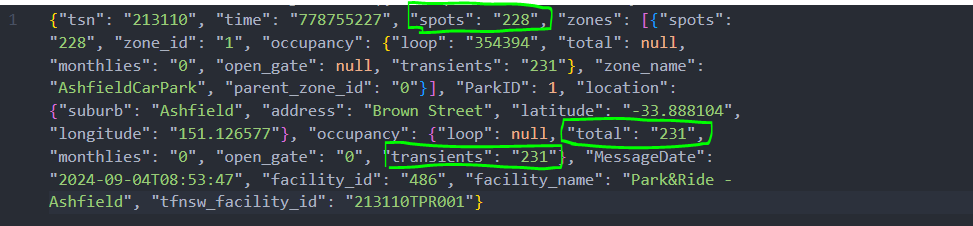

# Park&Ride Backend API

## 1. 项目介绍
IHELP Project

获取NSW政府停车场数据，并提供API接口，提供给IHELP项目前端使用

/stations 提供所有车站信息，包括空余车位数，车站名称，车站位置，车站ID等； **测设中**
/stations/id/annouce 提供某一车站的详细信息，包括空余车位数，车站名称，车站位置，车站ID等; **未完成**

## 2. 项目结构

## 2. 项目结构

- app/
    - main.py
    - routers/
        - stations.py
- data/
    - station.parquet
    - station_geo.parquet
    - parking_lots.parquet
- data_backend/
- test/
- README.md
- requirements.txt

## 3. 项目依赖
请见requirements.txt

## 4. 项目配置
当前在app文件夹下使用`python -m fastapi dev main.py`启动fastapi web api服务。
本地浏览器使用http://127.0.0.1:8000/docs 访问API文档。

## 5. 项目部署

## 6. 项目维护

## 7. 项目文档

## 8. 项目贡献

## 9. 项目反馈

## 10. 项目许可

## 11. 项目版本

## 12. 项目作者

## 13. TODO List
1. 会出现某个车站的空余车位数为负数的情况，例如 facility_id 486

2. 各车站Zone信息会提供更精确的停车位信息，可以进一步利用
3. 增加停车位json数据读取函数，同时保留读取parquet文件能力
4. Timestap使用原始数据中的时间戳会更用户友好
